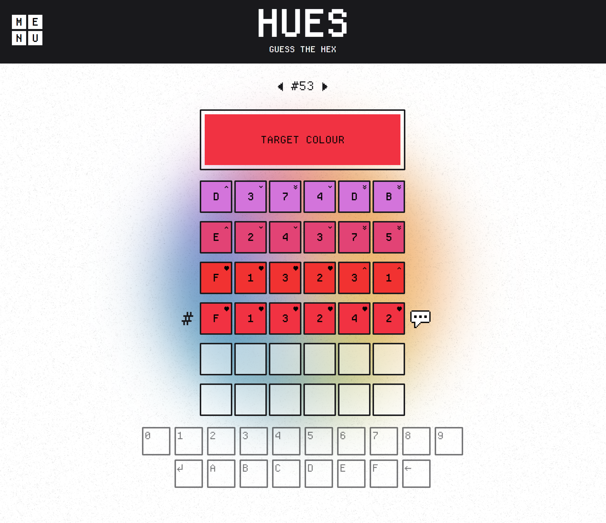
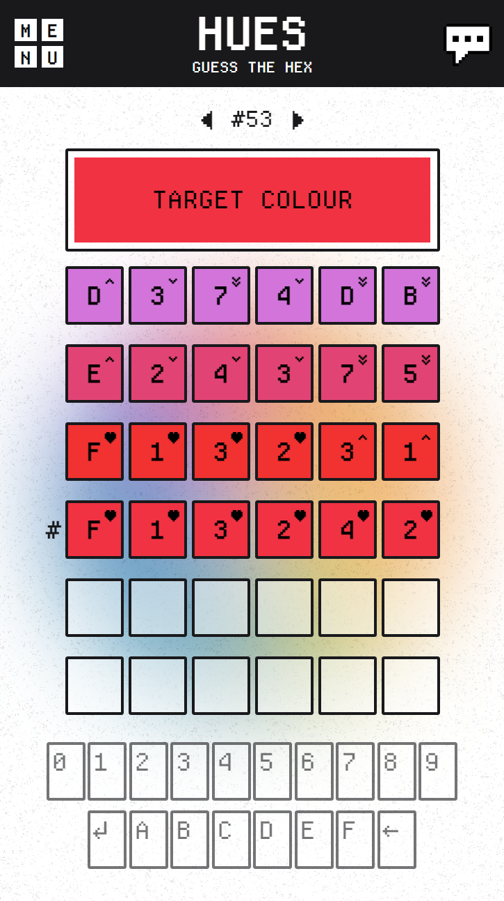
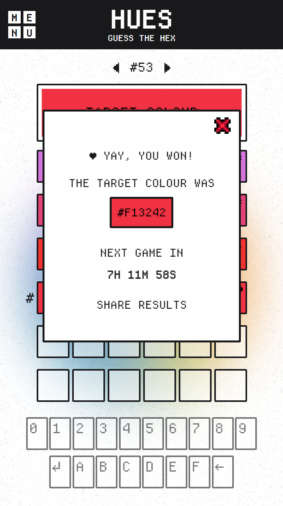

## HUES

Hues is a puzzle game where players guess hexadecimal colour codes. Similar to Wordle, the goal is to find the correct six-character code representing a colour in the hexadecimal format (e.g: #1A2B3C). Players have a limited number of attempts to guess the right code.

## Tech Stack / Tools

## Gallery

**Large Screen View**

**Small Screen View**

  
  

